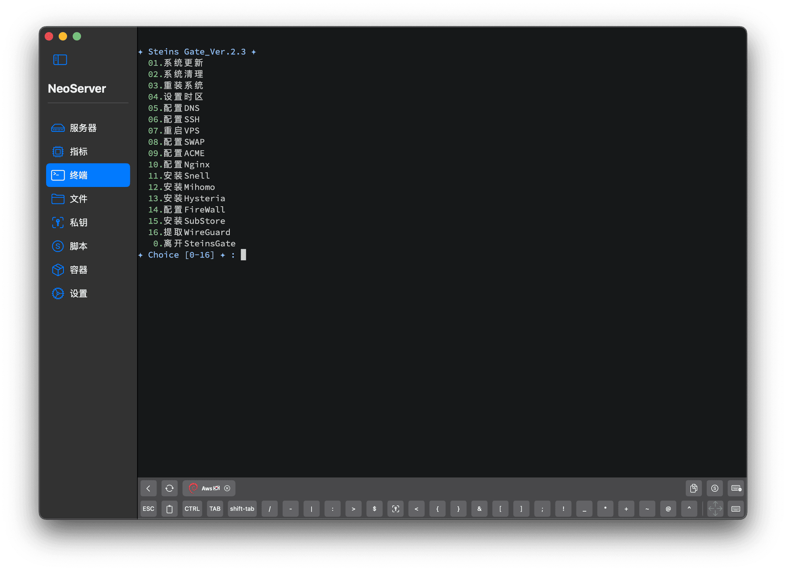

## 𝐔𝐬𝐞  ##

```
bash <(curl -sL https://raw.githubusercontent.com/Steins/Nothing/Gate/Shell/SteinsGate.sh)
```


## 𝐁𝐥𝐨𝐠 ##
https://snell.us.kg


## 𝐂𝐡𝐚𝐧𝐧𝐞𝐥 ##
https://t.me/ygking


## 𝐑𝐨𝐮𝐭𝐢𝐧𝐠 𝐑𝐮𝐥𝐞𝐬 ##

https://github.com/SukkaW/Surge


https://github.com/luestr/ShuntRules


https://github.com/blackmatrix7/ios_rule_script/tree/master/rule
